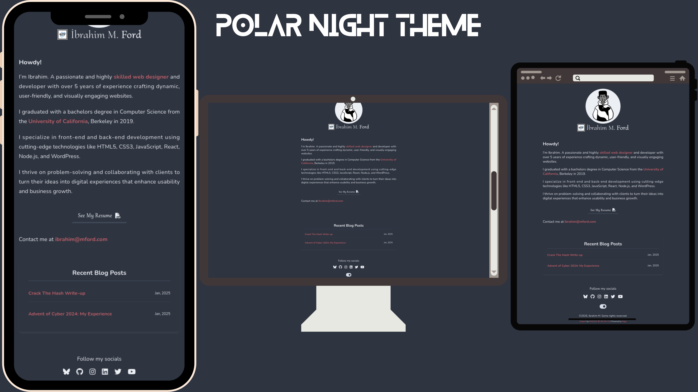
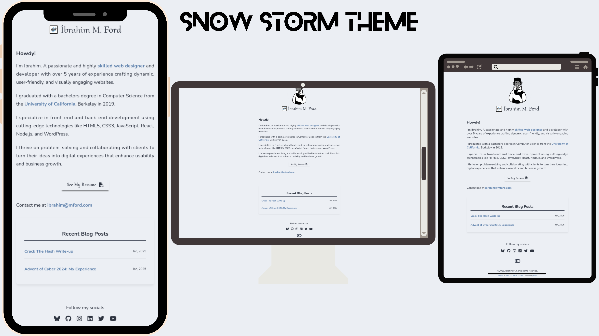

<div style="text-align:center;">
<!---->

    <p>
        
        
        
        
        
    </p>
    <h1 id="uniport-h">Uniport-H <span style="font-size: small">v1.0.0</span></h1>
</div>

UniPort is a lightweight customizable one-page portfolio theme built for [Hugo](https://gohugo.io/).
The design is partly inspired by [Brian Yu's Website](https://brianyu.me)

## 🧐 Features
- Lightweight
- Customizable
- RSS Integration
- Single Page Layout
- Google Analytics Support
- Supports dark & light mode

## 🚀 Demo
- Demo [links]()
  - [🔗 Demo website](https://uniport-h.msio.me/)
  - [🔗 My own website](https://msio.me/)

| 📸 Screenshots                   |
|----------------------------------|
|  |
|                                  |
|   |

## 🛠️ Setup

> ### Prerequisites:
> - Git
> - nodejs & npm
> - npm sharp v0.33.5
> - Hugo _(minimum v0.123.0)_

1. This theme is available as a template.
   - Click on the <kbd>Use this template</kbd> button and then select <kbd>Create a new repository</kbd>.
   - Name the new repository with a name of your choice.
   - Clone the repository then modify to your satisfaction.

2. If you don't want to use the template you can follow the steps below:
   - In your site's root directory run the following commands below
     ```sh
     $ git init
     ```
     ```sh
     $ git submodule add https://github.com/msio808/uniport-h.git themes/uniport-h
     ```
---

After completing any of the steps above:
- In the `static/img` directory, place your avatar namef avatar.png & logo named brand.png.
- copy the [config.toml](../config.toml) file to your site's root directory.

<details>
<summary style="font-size: 1rem;">📝 Click to view the <b>config.toml</b> file</summary>

```toml

baseURL = "" # Replace with your domain
languageCode = "" # Example: en_US, tr_TR...etc.
title = "" # Replace with the title of your site

# NOTE:
#   Values must be provided to the following parameters before running your site
#   - FirstName, LastName, Skills, JobTitle, SiteDescription and Profile Summary.
# ----------------------------------------------------------------------------------------
# The default site title is written as "First Name | Job Title"
# If you want to use custom site title with the title parameter above
# then change the value of the parameter 'defaultTitle' to true.
[params]
defaultTitle = false

    FirstName = ""
    LastName = ""
    Skills = [ "", "" ]
    SiteDescription = ""

    JobTitle = ""
    Organization = ""

    Education = ""
    Institution = ""

# Rename your avatar to avatar.png and logo to brand.png.
# place them in the `static/img` directory then run the npm install command
# If you want to link your resume, name the resume file `resume.pdf`
# And place the file in the `static/resources` directory.

[params.Profile]
Greetings = "Howdy!"
Summary = [
"Paragraph 1",
"Paragraph 2"
]
Email = ""

[params.rssFeed]
# If you have a blog that you want to embed to your site
# Specify the RSS feed url of your blog (ie: https://blog.com/feed.xml)
# The 3 most recent post from your site will be displayed.
    Url = ""

[params.Socials]
# Place your entire social url as shown below.
    GitHub = "https://github.com/your_handle"
# If you don't want to display a social icon, leave it empty ''
    LinkedIn = ""
# If you want to add more social links to it, makesure the icons are available
# in the fontawesome fab / fa-brand icon repository.

[params.Footer]
# Name to show in the copyright message
    ccName = ""
# Displays: ©️${CurrentYear}, ${YourName}. Some Rights Reserved

[params.googleAnalytics]
# Replace the id below with your google analytics measurement ID
    Id = "G-XXXXXXXXXX"


# Do not edit
[outputs]
home = ["HTML", "RSS"]
[minify]
minifyOutput = true
enableRobotsTXT = true
enableFingerprinting = true
[taxonomies]

```
</details>

- If you chose option 2, execute the following command:
  ```shell
    $ echo 'theme = "uniport-h"' >> config.toml
  ```

- Run the following command to generate favicons, twittercard & opengraph images for your site
  ```shell
  npm install
  ```
This will install the required package/s to generate favicons and twittercard & opengraph images

When you're done, run either of the following command:

- To live preview your site
  ```shell
  npm run preview
  ```
- To build your hugo site
  ```shell
  npm run build
  ```
- Or if you have sharp installed but you haven't generated favicons yet:
  ```sh
  npm run favicons
  ```

Preview your site at [localhost:1313](http://localhost:1313).

## 🍰 Contributing
[](CODE_OF_CONDUCT.md)
- Check out this guide [link](https://daily.dev/blog/how-to-contribute-to-open-source-github-repositories)
- Also makesure to record your changes in the [changelog](CHANGELOG.md) file.

## 🛡️ License:
<p xmlns:cc="https://creativecommons.org/ns#" xmlns:dct="https://purl.org/dc/terms/">
    <a property="dct:title" rel="cc:attributionURL" href="https://github.com/msio808/uniport-h.git">This project</a>
    <a rel="cc:attributionURL dct:creator" property="cc:attributionName" href="https://msio.me" ></a>
    is licensed under
    <a href="https://creativecommons.org/licenses/by-nc-sa/4.0/?ref=chooser-v1"
    target="_blank" rel="license noopener noreferrer" style="display: inline-block">Creative Commons Attribution-NonCommercial-ShareAlike 4.0 International </a>
    
    
    
    
</p>

## 🙏 Acknowledgement
- The team behind [NordTheme](https://www.nordtheme.com/)
- The team and community behind [Hugo](https://gohugo.io)
- [GOOGLE FONTS](https://fonts.google.com/)
- [FONT AWESOME](https://fontawesome.com/)
- [Brian Yu](https://brianyu.me)
- [CANVA](https://canva.com)
