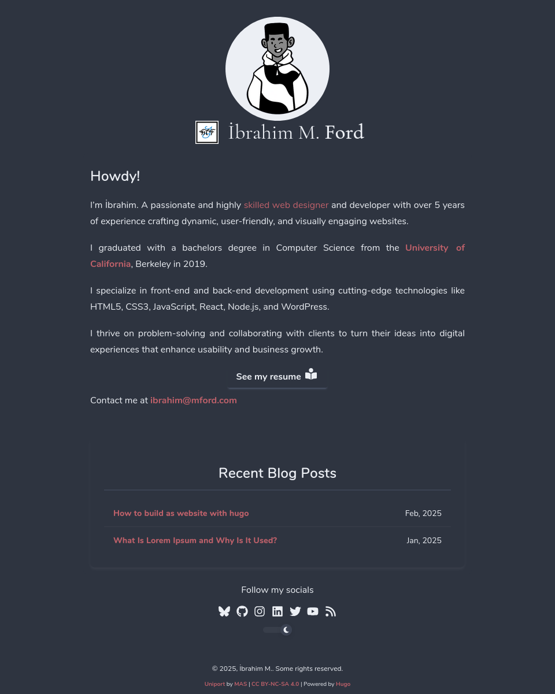
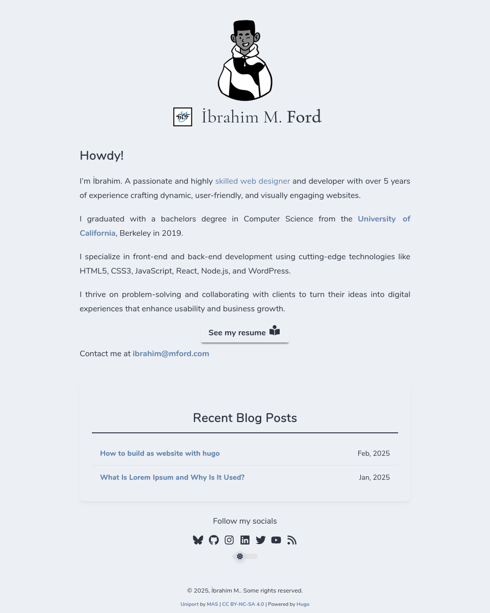

<div style="text-align:center;">


# Uniport-H

</div>

<div style="font-size: medium">

UniPort is a lightweight customizable one-page portfolio theme built for [Hugo](https://gohugo.io/).

</div>

## 🚀 Demo
- Demo [link](#)

| POLAR NIGHT                | SNOW STORM                |
|----------------------------|---------------------------|
|  |  |

## 🧐 Features
- Customizable
- Lightweight
- RSS Integration
- Single Page Layout
- Google Analytics Support
- Supports dark & light mode

## 🛠️ Setup

> Make sure you have Hugo & Git installed.

```sh
$ hugo new site my-site && cd my-site/
```

```sh
$ git init
```
```sh
$ git submodule add https://github.com/msio808/uniport-h.git themes/uniport-h
```
```sh
$ echo 'theme = "uniport-h"' >> config.toml
```
```sh
$ hugo server -t uniport-h
```

After completing the steps above, visit your site at [localhost:1313](http://localhost:1313).

## 🍰 Contributing
[](CODE_OF_CONDUCT.md) 

## ⏳ Progress Report
- 🟡 In Progress
- 📅 10/Feb/2025

## 🛡️ License:
<p xmlns:cc="https://creativecommons.org/ns#" xmlns:dct="https://purl.org/dc/terms/">
    <a property="dct:title" rel="cc:attributionURL" href="https://github.com/msio808/uniport-h.git">This project</a>
    <a rel="cc:attributionURL dct:creator" property="cc:attributionName" href="https://msio.me" ></a>
    is licensed under
    <a href="https://creativecommons.org/licenses/by-nc-sa/4.0/?ref=chooser-v1"
    target="_blank" rel="license noopener noreferrer" style="display: inline-block">Creative Commons Attribution-NonCommercial-ShareAlike 4.0 International
    
    
    
    
    </a>
</p>

## 🙏 Acknowledgement
- The team behind [NordTheme](https://www.nordtheme.com/)
- The team and community behind [Hugo](https://gohugo.io)
